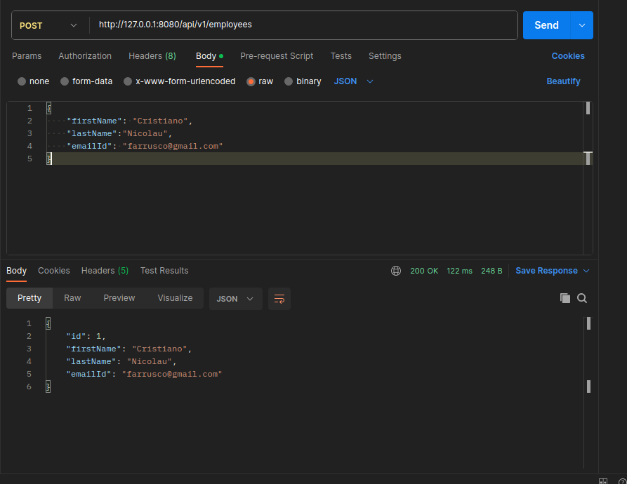
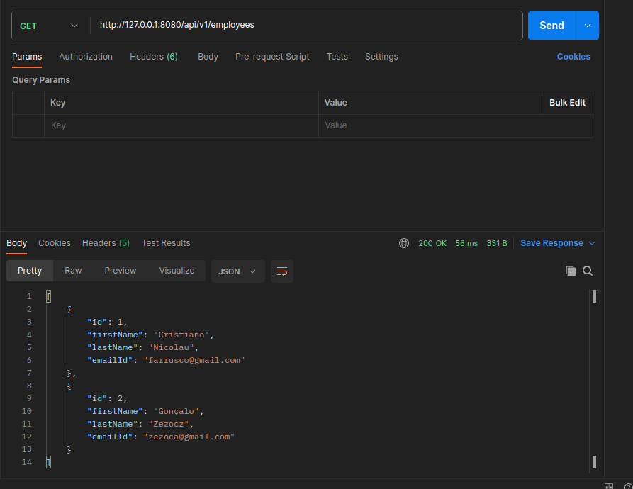
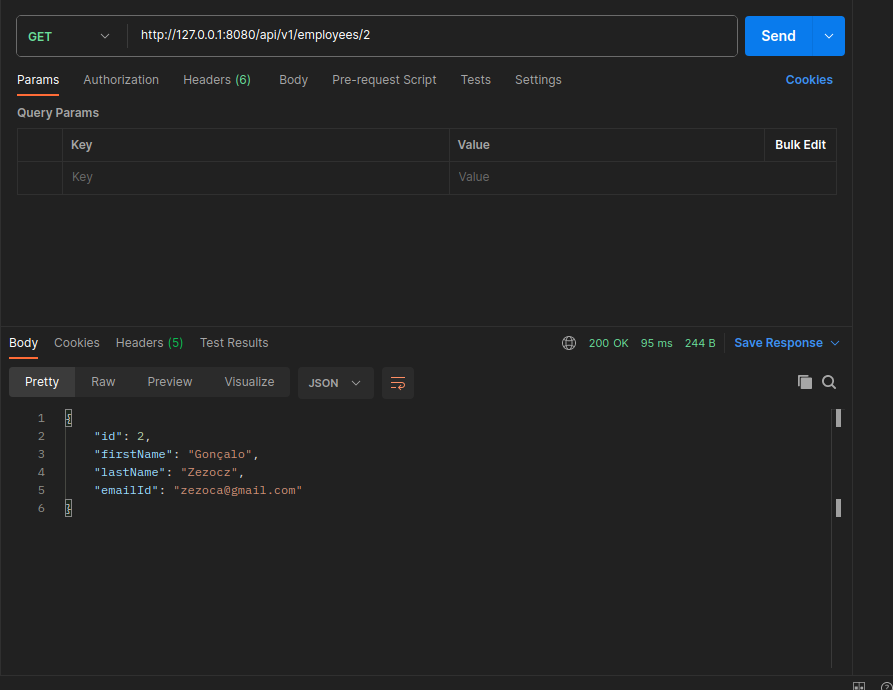
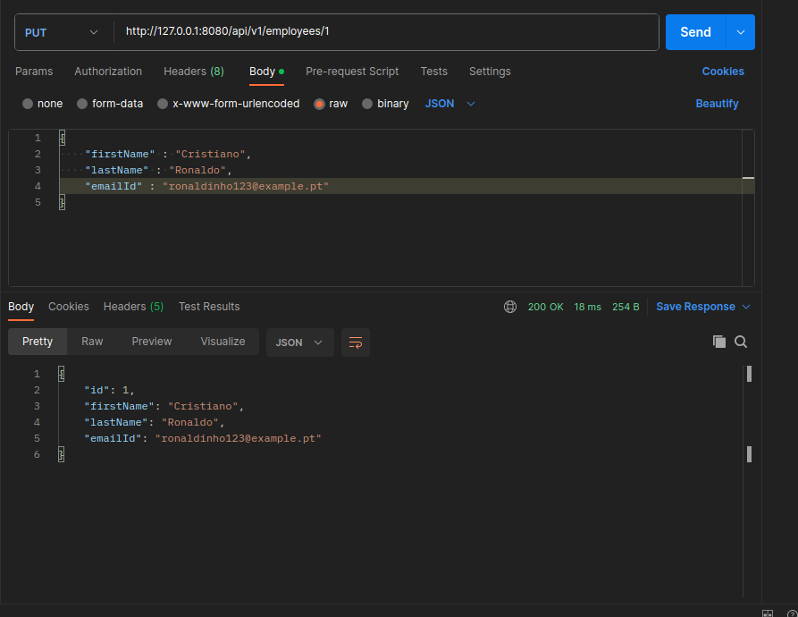
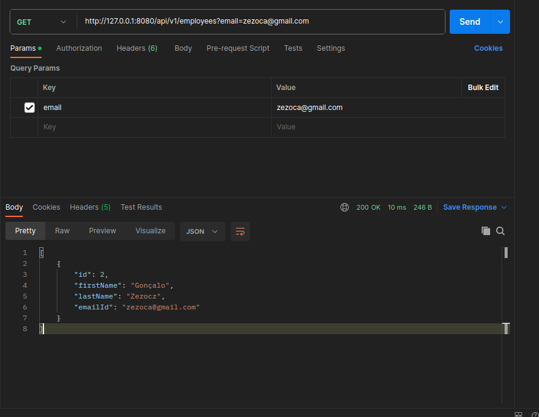
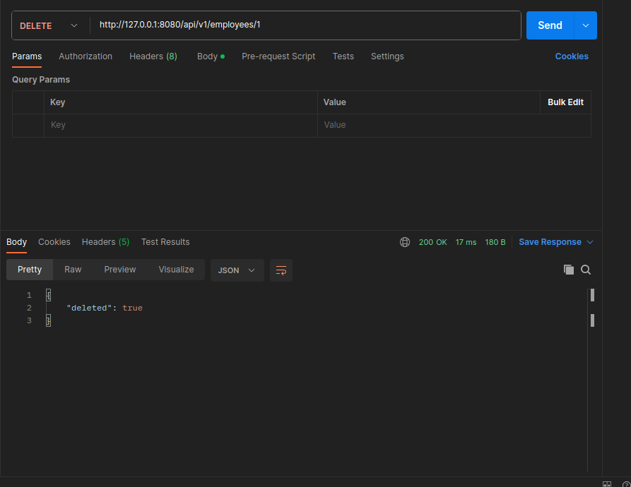

# Config mysql in docker

```bash
docker run --name mysql5 -e MYSQL_ROOT_PASSWORD=secret1 -e MYSQL_DATABASE=demo -e MYSQL_USER=demo -e MYSQL_PASSWORD=secret2 -p 33060:3306 -d mysql/mysql-server:5.7
```

* MYSQL_ROOT_PASSWORD=secret1 - root password
* MYSQL_DATABASE=demo - database name
* MYSQL_USER=demo - user name
* MYSQL_PASSWORD=secret2 - user password
* -p 33060:3306 - port mapping


# Connect to mysql

```bash
docker exec -it mysql5 mysql -u root -p
```

* -u root - user name
* -p - password

# Create database

```sql
create database user_management;
use user_management;
```

* create database user_management - create database
* use user_management - use database

# Create project

Spring Initializr was used, using the following starter dependencies:

* Spring Web
* Spring Data JPA
* MySQL Driver
* DevTools
* Validation

# Structure of the project

* Employee - entity class 
* EmployeeRepository - repository interface
* EmployeeController - controller class

# Run project

```bash
mvn spring-boot:run
```

# Test API with Postman

* Create employee

```bash
POST http://127.0.0.1:8080/api/v1/employees
```



* Get all employees

```bash
GET http://127.0.0.1:8080/api/v1/employees
```



* Get employee by id

```bash
GET http://127.0.0.1:8080/api/v1/employees/2
```



* Update employee

```bash
PUT http://127.0.0.1:8080/api/v1/employees/1
```



* Get employee by email

```bash
GET http://127.0.0.1:8080/api/v1/employees?email=
```



* Delete employee

```bash
DELETE http://127.0.0.1:8080/api/v1/employees/1
```




